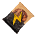
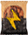

# Barotrauma - Protein Cookie
This is a simple xml-only modification for the game [Barotrauma](https://store.steampowered.com/app/602960/Barotrauma/)

### Overview
Adds a new consumable item similar to the existing [Protein Bar](https://barotraumagame.com/wiki/Protein_Bar)
|Name|ID|Icon|Sprite|Effects|Use Time|Price|
|-|-|-|-|-|-|-|
Protein Cookie|`proteincookie`|||-2 Damage -1 Burn +35 Vigor|4 seconds|40 mk|

### Installation
- Through steam workshop - [Workshop item](https://steamcommunity.com/sharedfiles/filedetails/?id=3490136207)
- Manually -
[Guide](https://github.com/JustKesha/baro-jovian-bananas#installation)